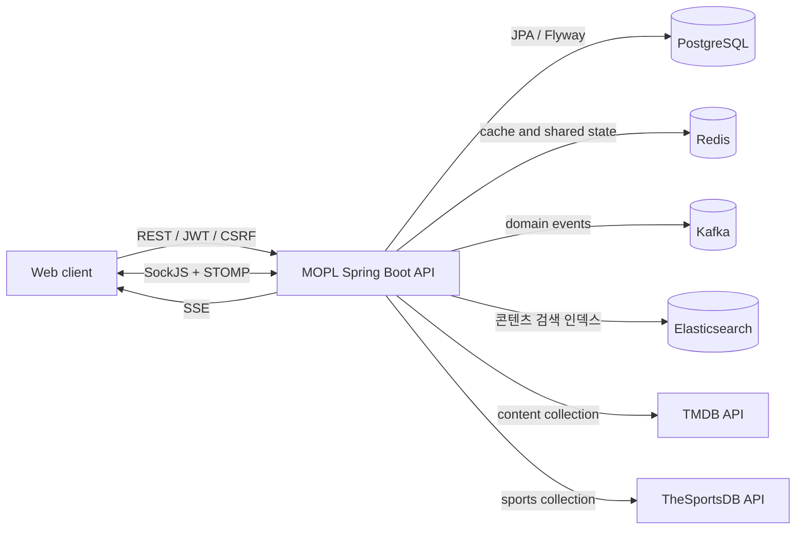

# MOPL

[](https://github.com/ow00us/sb11-mopl-team1/actions/workflows/ci.yml)
[](https://codecov.io/gh/ow00us/sb11-mopl-team1)

콘텐츠를 탐색하고 리뷰·플레이리스트·실시간 시청 경험을 공유하는 소셜 플랫폼의 백엔드입니다. 영화·TV 시리즈·스포츠 콘텐츠를 중심으로 사용자 관계, 콘텐츠 평가, 컬렉션, 메시징과 실시간 시청 상태를 하나의 서비스에서 제공합니다.

## 주요 기능

| 영역 | 제공 기능 |
| --- | --- |
| 사용자·인증 | 회원가입, 이메일 로그인, JWT 인증, 역할·잠금 관리, 프로필 관리 |
| 콘텐츠 | 영화·TV 시리즈·스포츠 조회, 관리자 CRUD, TMDB·TheSportsDB 데이터 수집 |
| 리뷰 | 리뷰 CRUD, 사용자별 중복 방지, 평점·리뷰 수 집계 |
| 플레이리스트 | 플레이리스트 CRUD, 콘텐츠 편집, 구독·구독자 목록 |
| 소셜 | 팔로우·언팔로우, 팔로워·팔로잉 조회 |
| 알림·DM | 알림 조회·삭제, 대화방 관리, DM 저장·조회·읽음 처리와 실시간 전송 |
| 같이 보기 | 시청 세션 조회, 콘텐츠 입장·퇴장 상태 전파, 콘텐츠 채팅 |

## 시스템 구성



## ERD

ERD는 `src/main/resources/db/migration`에 정의된 실제 Flyway 스키마를 기준으로 합니다. 테이블 검색, 도메인 필터와 FK 관계 강조를 지원하는 별도 화면에서 전체 구조를 확인할 수 있습니다.

[](https://ow00us.github.io/sb11-mopl-team1/erd/)

이미지를 누르면 검색, 도메인 필터와 FK 관계 강조를 지원하는 상세 ERD가 열립니다.

**[상세 ERD 열기](https://ow00us.github.io/sb11-mopl-team1/erd/)**

주요 무결성 규칙은 다음과 같습니다.

- 사용자는 같은 콘텐츠에 리뷰를 하나만 작성할 수 있습니다.
- 리뷰 평점은 `0.0~5.0` 범위에서 `0.5` 단위로 저장합니다.
- 플레이리스트에는 같은 콘텐츠를 중복으로 추가할 수 없습니다.
- 사용자는 같은 플레이리스트를 중복 구독할 수 없습니다.
- 자기 자신을 팔로우할 수 없으며 같은 사용자를 중복 팔로우할 수 없습니다.
- 대화 참여자는 `FIRST`, `SECOND` 슬롯으로 제한되어 한 대화에 최대 두 명만 참여합니다.
- DM 발신자는 해당 대화의 참여자여야 합니다.
- 사용자는 동시에 하나의 시청 세션 스냅샷만 소유할 수 있습니다.
- 외부 콘텐츠는 `(source, external_id)` 조합으로 중복 수집을 방지합니다.
- 콘텐츠는 `deleted_at`을 사용하는 soft delete 구조입니다.

## 프로젝트 구조

애플리케이션은 도메인별 패키지 안에 컨트롤러, 서비스, 저장소와 DTO를 배치합니다. 인증·오류 처리·설정·공통 응답처럼 여러 도메인이 공유하는 코드는 `global`에서 관리합니다.

```text
sb11-mopl-team1
├── .github
│   ├── ISSUE_TEMPLATE        # 버그·개발 작업 이슈 양식
│   ├── workflows/ci.yml      # 빌드, 테스트, 커버리지와 컨테이너 smoke CI
│   └── pull_request_template.md
├── openapi
│   ├── reference             # 최초 제공된 기준 OpenAPI
│   ├── mopl-api.yaml         # 팀이 관리하는 REST 계약
│   └── realtime-contract.md  # WebSocket·STOMP 실시간 계약
├── src
│   ├── main
│   │   ├── java/com/mopl
│   │   │   ├── content          # 콘텐츠 CRUD와 외부 데이터 수집
│   │   │   ├── directmessage    # 대화방과 DM
│   │   │   ├── follow           # 사용자 팔로우 관계
│   │   │   ├── global           # 보안, 설정, 공통 오류와 응답
│   │   │   ├── notification     # 사용자 알림
│   │   │   ├── playlist         # 플레이리스트와 구독
│   │   │   ├── review           # 리뷰와 평점 집계
│   │   │   ├── user             # 사용자와 인증
│   │   │   └── watchingsession  # 시청 세션과 콘텐츠 채팅
│   │   └── resources
│   │       ├── db/migration      # Flyway 스키마와 인덱스 변경
│   │       └── application.yml   # dev·prod 프로필 설정
│   └── test
│       ├── java/com/mopl         # 단위·통합·STOMP E2E 테스트
│       └── resources             # test 프로필과 Testcontainers 설정
├── build.gradle                  # 의존성, 테스트와 JaCoCo 80% 게이트
├── docker-compose.yml            # PostgreSQL, Redis, Kafka 개발 환경
├── Dockerfile                    # 멀티 스테이지 운영 이미지
├── DEPLOYMENT.md                 # 운영 실행과 배포 계약
└── README.md
```

## 기술 스택

| 구분 | 기술 |
| --- | --- |
| Language | Java 17 |
| Framework | Spring Boot 3.4, Spring Security, Spring Data JPA, Spring WebSocket, Spring Batch |
| Data | PostgreSQL 16, Flyway, Redis 7, Kafka 3.8, Elasticsearch 8.15(nori) |
| API | REST, OpenAPI 3.1, SockJS, STOMP, SSE |
| Test | JUnit 5, Spring Boot Test, Testcontainers, JaCoCo |
| Operations | Docker, GitHub Actions, Spring Boot Actuator, Prometheus |

## API와 실시간 통신

### REST API

| 기본 경로 | 영역 |
| --- | --- |
| `/api/auth` | 로그인과 CSRF 토큰 발급 |
| `/api/users` | 사용자 등록·조회·수정과 관리자 기능 |
| `/api/contents` | 콘텐츠 CRUD·조회와 콘텐츠별 시청 세션 |
| `/api/reviews` | 리뷰 CRUD와 목록 조회 |
| `/api/playlists` | 플레이리스트·콘텐츠·구독 관리 |
| `/api/follows` | 팔로우 관계와 목록 조회 |
| `/api/notifications` | 알림 목록과 삭제 |
| `/api/conversations` | 대화방과 DM 조회·읽음 처리 |
| `/api/admin/outbox` | Kafka 발행 실패 이벤트 조회·재시도·스킵 |

목록 API는 커서 기반 페이지네이션을 사용합니다. 실제 요청·응답 필드와 상태 코드는 실행 중인 Swagger UI와 팀이 관리하는 기준 계약 `openapi/mopl-api.yaml`을 우선합니다. `openapi/reference/provided-openapi.json`은 최초 제공·비교용 문서입니다.

### 콘텐츠 검색

`GET /api/contents`는 Elasticsearch(nori 형태소 분석기)로 검색·정렬·필터링합니다.

- 필터: `typeEqual`(콘텐츠 타입), `keywordLike`(제목·설명 검색), `tagsIn`(태그, AND 조건)
- 정렬: `sortBy`(`createdAt` | `watcherCount` | `averageRating`), `sortDirection`

### 인증과 CSRF

- 보호된 REST API는 `Authorization: Bearer <access-token>` 헤더를 사용합니다.
- 브라우저의 상태 변경 요청은 `XSRF-TOKEN` 쿠키 값과 같은 값을 `X-XSRF-TOKEN` 헤더로 전달합니다.
- 공개 경로를 제외한 요청은 JWT 인증을 요구합니다.
- 인증 실패는 `401`, 권한 부족은 `403`으로 구분합니다.

### WebSocket·STOMP

- SockJS 연결 엔드포인트: `/ws`
- 클라이언트 송신 prefix: `/pub`
- 서버 구독 prefix: `/sub`
- STOMP `CONNECT` 프레임의 `Authorization` 헤더에 Bearer 액세스 토큰을 전달합니다.
- 서버와 클라이언트 heartbeat 주기는 각각 4초입니다.

| 목적 | 송신 또는 구독 destination |
| --- | --- |
| 콘텐츠 채팅 송신 | `/pub/contents/{contentId}/chat` |
| 콘텐츠 채팅 구독 | `/sub/contents/{contentId}/chat` |
| 시청 상태 구독 | `/sub/contents/{contentId}/watch` |
| DM 송신 | `/pub/conversations/{conversationId}/direct-messages` |
| DM 구독 | `/sub/conversations/{conversationId}/direct-messages` |

STOMP destination은 서버의 허용 목록과 대화 참여자 권한 검사를 통과해야 합니다. 처리 중 발생한 인증·인가·요청 오류는 STOMP `ERROR` 프레임으로 전달됩니다.

### SSE

`GET /api/sse`는 Server-Sent Events 연결을 제공합니다.

- 알림: Kafka 이벤트를 소비해 DB에 저장하고, 그 트랜잭션이 커밋된 뒤에만 SSE로 전송합니다.
- DM: 저장 트랜잭션이 커밋되면 항상 STOMP로 브로드캐스트하고, 수신자가 해당 대화방을 STOMP로 구독 중이 아닐 때만 SSE로도 전달합니다(구독 중이면 STOMP로만 전달). DM도 Kafka에 이벤트를 발행하지만 이는 알림 생성을 위한 것이고, DM 자체의 실시간 전달은 Kafka를 거치지 않습니다.

## 비동기 처리와 안정성

### Kafka와 Outbox

팔로우·플레이리스트 구독·DM 이벤트는 Outbox 패턴으로 발행합니다. 도메인 상태 변경과 이벤트 기록을 같은 트랜잭션에 남기고, 별도 스케줄러가 커밋된 이벤트만 Kafka로 relay합니다. 자세한 계약은 [`docs/07-kafka-outbox-contract.md`](docs/07-kafka-outbox-contract.md)를 참고하세요.

Kafka 소비 실패는 재시도 후에도 실패하면 Dead Letter Topic으로 격리되고, `/api/admin/outbox/failures`로 조회·재시도·스킵할 수 있습니다.

### 콘텐츠 검색 동기화

콘텐츠 생성·수정·삭제는 Elasticsearch 색인과 비동기로 동기화됩니다. 동기화가 실패하면 재시도 대기열(`content_search_retries`)에 기록되어 별도 스케줄러가 재적용합니다. 애플리케이션 시작 시 색인이 없으면 자동 생성하고, 색인에 문서가 하나도 없으면 PostgreSQL 데이터로 백필합니다.

### Redis 사용처

Redis는 세 가지 용도로 나뉩니다.

- 범용 캐시·직렬화된 값 저장
- 카운터·토큰 관련 연산(리프레시 토큰 등)
- 시청 세션 입장·퇴장 상태(presence) 관리(TTL 기반)

### 외부 API 배치

TMDB·TheSportsDB 데이터 수집은 Spring Batch로 매일 새벽 4시(KST)에 실행되며, 이미 실행 중이면 중복 실행하지 않습니다.

알려진 제한사항은 다음과 같습니다.

- 배치 Step의 skip 대상이 `RuntimeException` 전체로 열려 있어, 매핑 오류와 일시적 장애를 구분하지 않고 동일하게 건너뜁니다.
- 외부 API 호출에 rate limit·백오프가 아직 없어, 대량 실패 시 재시도 없이 유실될 수 있습니다.

## 로컬 개발 환경

### 사전 준비

- JDK 17
- Docker와 Docker Compose

### 1. 인프라 실행

```bash
docker compose up -d
```

다음 서비스가 실행됩니다.

| 서비스 | 로컬 주소 또는 포트 |
| --- | --- |
| PostgreSQL | `localhost:5432` |
| Redis | `localhost:6379` |
| Kafka | `localhost:9092` |
| Elasticsearch | `localhost:9200` |

PostgreSQL 개발 계정은 `mopl / mopl`이며 데이터베이스 이름은 `mopl`입니다. 애플리케이션 시작 시 Flyway가 스키마 마이그레이션을 적용합니다.

### 2. 환경 변수 설정

| 환경 변수 | 설명 | 기본값 |
| --- | --- | --- |
| `JWT_SECRET` | JWT 서명에 사용할 Base64 인코딩 비밀키 | 없음 |
| `JWT_ACCESS_TOKEN_EXPIRATION` | 액세스 토큰 만료 시간 | `30m` |
| `TMDB_ACCESS_TOKEN` | TMDB API 액세스 토큰 | 없음 |
| `SPORTSDB_API_KEY` | TheSportsDB API 키 | 없음 |
| `CORS_ALLOWED_ORIGINS` | REST API를 허용할 프론트엔드 origin | `http://localhost:5173` |
| `WS_ALLOWED_ORIGINS` | WebSocket 연결을 허용할 프론트엔드 origin | `http://localhost:5173` |
| `ELASTICSEARCH_URIS` | Elasticsearch 접속 주소(prod 필수) | `http://localhost:9200`(dev) |

비밀값은 저장소에 커밋하지 않습니다. `prod` 프로필에서는 CORS와 WebSocket 허용 origin을 반드시 외부에서 주입해야 합니다.

### 3. 애플리케이션 실행

macOS 또는 Linux:

```bash
./gradlew bootRun
```

Windows:

```powershell
.\gradlew.bat bootRun
```

기본 서버 주소는 `http://localhost:8080`입니다. 애플리케이션 상태는 `GET /actuator/health`에서 확인할 수 있습니다.

### 4. 로컬 환경 종료

```bash
docker compose down
```

PostgreSQL 데이터까지 제거해야 할 때만 `docker compose down --volumes`를 사용합니다.

## 테스트와 커버리지

Docker가 실행 중인 상태에서 전체 테스트와 JaCoCo 커버리지 검증을 실행합니다. 저장소 테스트에는 PostgreSQL·Kafka·Redis Testcontainers를 사용하는 통합 테스트가 포함되어 있습니다. Elasticsearch는 대부분의 테스트에서 mock으로 대체하고, 검색 회귀 테스트 하나만 nori 플러그인이 포함된 실제 컨테이너로 검증합니다.

macOS 또는 Linux:

```bash
./gradlew clean test jacocoTestCoverageVerification
```

Windows:

```powershell
.\gradlew.bat clean test jacocoTestCoverageVerification
```

프로젝트 전체 라인 커버리지가 80% 미만이면 검증과 CI가 실패합니다.

| 산출물 | 경로 |
| --- | --- |
| 테스트 결과 | `build/reports/tests/test/index.html` |
| JaCoCo HTML | `build/reports/jacoco/test/html/index.html` |
| JaCoCo XML | `build/reports/jacoco/test/jacocoTestReport.xml` |

## CI 파이프라인

GitHub Actions는 `main` 또는 `develop`을 대상으로 하는 pull request와 두 브랜치의 push에서 실행됩니다.

1. JDK 17과 Gradle 환경을 준비합니다.
2. 전체 빌드·테스트와 라인 커버리지 80% 검증을 실행합니다.
3. JaCoCo HTML 리포트를 artifact로 업로드합니다.
4. `main` push가 성공하면 JaCoCo XML을 Codecov에 게시합니다.
5. 운영 이미지를 빌드하고 비특권 사용자 실행 여부를 확인합니다.
6. PostgreSQL·Redis와 함께 컨테이너를 기동하여 `/actuator/health` smoke 검증을 수행합니다.

## 운영 이미지

멀티 스테이지 Dockerfile은 애플리케이션을 빌드한 뒤 JRE 기반 이미지에 실행 파일만 포함합니다. 런타임 컨테이너는 비특권 사용자 `mopl`로 실행되며 `8080` 포트와 Actuator health check를 제공합니다.

```bash
docker build --tag mopl:local .
```

운영 프로필은 PostgreSQL·Redis 연결 정보, JWT 비밀키, CORS와 WebSocket origin을 환경 변수로 받아야 합니다. 필요한 값은 `src/main/resources/application.yml`의 `prod` 프로필을 기준으로 설정합니다.

## API 문서

애플리케이션 실행 후 다음 주소에서 확인할 수 있습니다.

- Swagger UI: `http://localhost:8080/swagger-ui.html`
- 런타임 OpenAPI JSON: `http://localhost:8080/v3/api-docs`
- 팀 관리 기준 REST 계약: `openapi/mopl-api.yaml`
- 최초 제공·비교용 문서: `openapi/reference/provided-openapi.json`

REST 계약을 변경할 때에는 구현, 테스트, 런타임 Swagger와 팀 관리 기준 계약 `openapi/mopl-api.yaml`을 함께 갱신합니다.

## 원본 계약 대비 변경점

`openapi/reference/provided-openapi.json`(원본, 32개 경로)과 현재 계약 `openapi/mopl-api.yaml`(46개 경로)을 비교한 결과입니다. 원본 경로는 하나도 삭제되지 않았습니다.

### 신규 엔드포인트 14개

| 영역 | 엔드포인트 |
| --- | --- |
| 관리자 Outbox 운영 | `GET /api/admin/outbox/failures`, `POST .../{eventId}/requeue`, `POST .../{eventId}/skip` |
| 팔로우 확장 조회 | `GET /api/follows/followers`, `GET /api/follows/followings`, `GET /api/follows/recommendations` |
| 플레이리스트 확장 | `GET /api/playlists/popular`, `GET /api/playlists/{playlistId}/subscribers` |
| 리뷰 | `GET /api/reviews/me` |
| 로컬 인증(소셜 로그인 사용자용) | `POST /api/users/{userId}/local-credentials`, `POST .../local-credentials/email-verifications` |
| OAuth 계정 관리 | `GET /api/users/{userId}/oauth-accounts`, `DELETE .../oauth-accounts/{provider}`, `POST .../oauth-accounts/{provider}/link` |

### 기존 스키마 필드 변경

- `ConversationDto`: 원본의 오타 `lastestMessage` → `latestMessage`
- `DirectMessageDto`: `messageSequence` 필드 추가
- `ErrorResponse`: `errorCode` 필드 추가
- `NotificationDto`: `resourceId`, `type` 필드 추가
- `SignInRequest`: `username` → `email`로 로그인 방식 변경

### 상태 코드 정비

- 생성 성공 응답을 `200`+`201` 혼용에서 `201`만 쓰도록 통일
- 본문 없는 성공 응답을 `200`+`204` 혼용에서 `204`만 쓰도록 통일
- 여러 오퍼레이션에 `404 Not Found`를 명시적으로 추가
- 리뷰 중복 작성, 이메일 중복 가입 등에 `409 Conflict` 추가

## 데이터베이스 변경

스키마 변경은 `src/main/resources/db/migration`의 Flyway 마이그레이션으로 관리합니다.

- 이미 적용된 마이그레이션 파일은 수정하지 않습니다.
- 새 변경은 최신 버전 다음 번호의 새 파일로 추가합니다.
- 애플리케이션 엔티티와 Flyway 스키마가 일치해야 합니다.
- 인덱스와 제약 조건은 조회 패턴과 데이터 무결성 근거를 함께 검토합니다.
