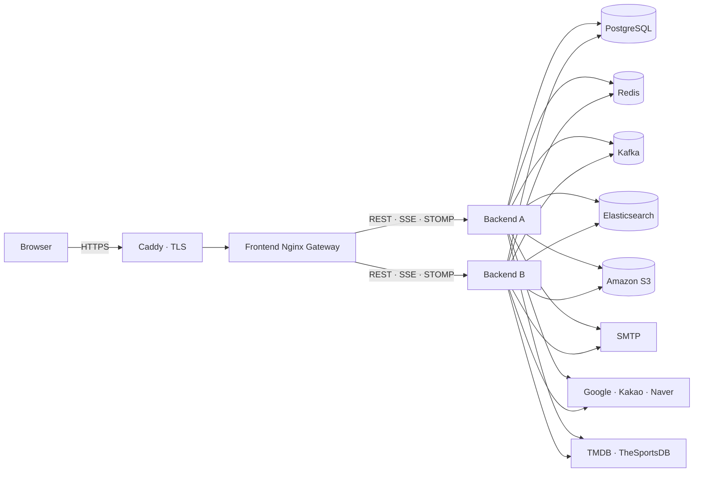
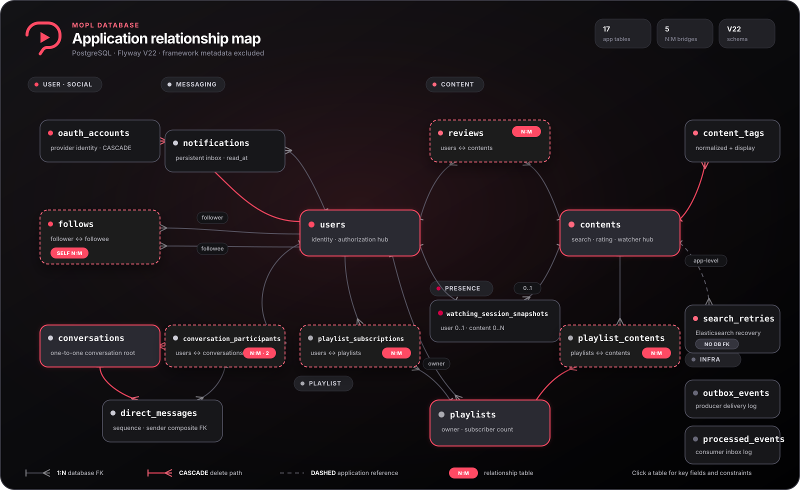

# MOPL


[](https://github.com/ow00us/sb11-mopl-team1/actions/workflows/ci.yml)
[](https://codecov.io/gh/ow00us/sb11-mopl-team1)

MOPL은 영화·TV 시리즈·스포츠 콘텐츠를 발견하고, 리뷰·플레이리스트·팔로우·실시간 대화를 통해 시청 경험을 나누는 콘텐츠 소셜 플랫폼입니다. 이 저장소는 REST API, 실시간 통신, 비동기 이벤트 처리와 운영 배포를 담당하는 Spring Boot 백엔드입니다.

## 제공 기능

| 영역 | 현재 구현 |
| --- | --- |
| 사용자·인증 | 이메일 가입·로그인, Access/Refresh Token 회전, Google·Kakao·Naver OAuth2, 소셜 계정 연결·해제, 역할·잠금·회원 탈퇴와 인증 즉시 차단 |
| 콘텐츠·검색 | 영화·TV 시리즈·스포츠 CRUD, Elasticsearch nori 검색, TMDB·TheSportsDB 수집, TMDB 한국어 정보 백필, 색인 실패 재시도 |
| 리뷰 | 리뷰 생성·수정·삭제, 사용자·콘텐츠 중복 방지, 평점·리뷰 수 원자 집계와 동시성 검증 |
| 플레이리스트 | 플레이리스트와 콘텐츠 편집, 구독·구독자 조회, 인기 플레이리스트 랭킹 |
| 소셜 | 팔로우·언팔로우, 팔로워·팔로잉 목록, 팔로우 추천 |
| 알림·DM | 읽음 시각과 전체 미읽음 수를 포함한 알림, 1:1 대화, 메시지 순서·읽음 워터마크, STOMP·SSE 실시간 전달 |
| 같이 보기 | Redis presence, 입장·전환·퇴장·heartbeat, 시청자 목록·수 집계, 콘텐츠 채팅과 최근 메시지 버퍼 |
| 운영 | Kafka·Transactional Outbox·DLT, 다중 인스턴스 Redis relay, S3 이미지 저장, ECR·SSM 기반 staging/production 배포 |

## 아키텍처

운영에서는 하나의 HTTPS origin 뒤에 프론트엔드 Gateway와 백엔드 두 인스턴스를 두고, 상태 저장소와 메시징 인프라를 공유합니다.



| 구성요소 | 책임 |
| --- | --- |
| PostgreSQL·Flyway | 사용자 데이터와 도메인 상태의 원본, 스키마·제약·인덱스 버전 관리 |
| Redis | Refresh Token과 인증 차단, OAuth 인가 요청, 이메일 인증, presence·채팅 버퍼·DM 상태, 인스턴스 간 Pub/Sub relay |
| Kafka·Outbox | 도메인 변경과 이벤트 기록의 원자성, 최소 한 번 발행, 알림 소비와 DLT 격리 |
| Elasticsearch | 콘텐츠 검색용 파생 인덱스, PostgreSQL 기반 초기 백필과 실패 재시도 |
| STOMP·SSE | 대화·채팅·시청 상태의 양방향 전달과 영속 알림의 실시간 전달·재연결 복구 |
| S3 | 프로필·콘텐츠 이미지의 다중 인스턴스 안전 저장 |

운영 토폴로지와 책임 경계는 [`docs/19-deployment-topology-adr.md`](docs/19-deployment-topology-adr.md), 실제 환경 변수와 복구 절차는 [`DEPLOYMENT.md`](DEPLOYMENT.md)를 기준으로 합니다.

## 데이터 모델

ERD는 `src/main/resources/db/migration`의 Flyway V22까지 반영합니다. 아래 개요는 17개 애플리케이션 테이블, 일반 1:N 관계선과 5개 N:M 관계 브리지를 함께 보여 주며, Spring Batch 메타데이터 6개 테이블과 초기 scaffold용 `sample` 테이블은 제외합니다.

[](https://ow00us.github.io/sb11-mopl-team1/erd/)

이미지를 누르면 테이블·핵심 필드 검색, 도메인 필터, FK 관계 강조를 지원하는 **[상세 ERD](https://ow00us.github.io/sb11-mopl-team1/erd/)**가 열립니다.

주요 무결성 규칙은 다음과 같습니다.

- `reviews`가 사용자와 콘텐츠 사이의 N:M 관계를 연결하며 `(author_id, content_id)`는 유일합니다.
- `playlist_contents`와 `playlist_subscriptions`가 각각 플레이리스트–콘텐츠, 사용자–플레이리스트 N:M 관계를 연결합니다.
- `follows`는 사용자 자기참조 N:M 관계이며 자기 자신 팔로우와 중복 팔로우를 차단합니다.
- `conversation_participants`는 사용자–대화 관계를 연결하고 `FIRST`, `SECOND` 슬롯으로 대화당 최대 두 명을 보장합니다.
- DM은 대화별 `message_sequence`가 유일하며, 발신자는 해당 대화 참여자여야 합니다.
- 사용자는 동시에 하나의 활성 시청 세션 스냅샷만 가질 수 있습니다.
- 외부 콘텐츠는 `(source, external_id)`, OAuth 계정은 `(provider, provider_user_id)` 조합으로 중복을 차단합니다.
- 콘텐츠와 사용자는 `deleted_at`을 사용하는 soft delete 구조입니다.
- Outbox는 사건별 `deduplication_key`, 알림 소비는 `(source_event_id, receiver_id)`로 중복 처리를 방지합니다.

## API와 실시간 계약

### REST

| 기본 경로 | 역할 |
| --- | --- |
| `/api/auth` | 로그인, 토큰 재발급·로그아웃, CSRF 토큰 |
| `/api/users` | 사용자·프로필·관리자 기능, OAuth 계정과 로컬 자격 증명 |
| `/api/contents` | 콘텐츠 CRUD·검색, 콘텐츠별 시청 세션 |
| `/api/reviews` | 리뷰 CRUD, 내 리뷰와 콘텐츠별 목록 |
| `/api/playlists` | 플레이리스트·콘텐츠·구독·인기 목록 |
| `/api/follows` | 팔로우 관계, 목록과 추천 |
| `/api/notifications` | 알림 목록, 단건·전체 읽음 처리와 미읽음 수 |
| `/api/conversations` | 대화방, DM 목록과 읽음 처리 |
| `/api/admin/outbox` | Producer Outbox 최종 실패 조회·재대기·스킵 |
| `/api/sse` | `Last-Event-ID` 기반 알림·DM 재연결 |

목록 API는 정렬값과 ID를 함께 사용하는 커서 페이지네이션을 적용합니다. 요청·응답·상태 코드는 [`openapi/mopl-api.yaml`](openapi/mopl-api.yaml)이 기준이며, 런타임 Swagger와의 차이는 CI 계약 테스트가 차단합니다. 최초 제공 계약과의 변경 이력은 [`openapi/README.md`](openapi/README.md)에서 관리합니다.

### 인증

- 보호된 REST 요청은 `Authorization: Bearer <access-token>`을 사용합니다.
- Access Token 기본 만료 시간은 `3h`이며 Refresh Token은 쿠키로 회전합니다.
- 브라우저의 상태 변경 요청은 `XSRF-TOKEN` 쿠키와 같은 값을 `X-XSRF-TOKEN` 헤더에 전달합니다.
- 잠금·권한 변경·비밀번호 변경·회원 탈퇴 시 기존 인증을 즉시 차단합니다.
- 인증 실패는 `401`, 권한 부족은 `403`으로 구분합니다.

### WebSocket·STOMP

- 연결: `/ws`
- 송신 prefix: `/pub`
- 구독 prefix: `/sub`
- 인증: STOMP `CONNECT`의 `Authorization: Bearer <access-token>`
- heartbeat: server/client 각 4초

| 목적 | Destination |
| --- | --- |
| 콘텐츠 채팅 송신·구독 | `/pub/contents/{contentId}/chat` · `/sub/contents/{contentId}/chat` |
| 시청 상태 구독 | `/sub/contents/{contentId}/watch` |
| DM 송신·구독 | `/pub/conversations/{conversationId}/direct-messages` · `/sub/conversations/{conversationId}/direct-messages` |

목적지별 인증·참여자 권한·rate limit·구독 상한을 적용하며, 처리 실패는 공통 STOMP `ERROR` 프레임으로 전달합니다. 전체 프레임 계약은 [`openapi/realtime-contract.md`](openapi/realtime-contract.md)를 참고하세요.

## 비동기 처리와 복구

```text
도메인 상태 변경 + Outbox 기록 (같은 DB 트랜잭션)
→ Outbox relay
→ Kafka
→ 알림 Consumer의 멱등 저장
→ DB COMMIT
→ SSE 전달
```

- 팔로우·플레이리스트 구독·DM 알림 이벤트는 Outbox로 최소 한 번 발행합니다.
- Consumer는 같은 `eventId`가 다시 와도 사용자에게 보이는 결과를 한 번만 생성합니다.
- Consumer 처리 실패는 재시도 후 DLT로 격리합니다. DLT 검사·수동 replay는 Outbox 운영 API와 별도 경로입니다.
- Outbox 장기 실패는 삭제하지 않고 `FAILED`로 보존하며 관리자가 재대기하거나 사유를 남겨 `SKIPPED`로 종결합니다.
- 실시간 전달이 끊겨도 알림·DM은 REST 조회로 복구하고, 인스턴스 간 전달은 Redis Pub/Sub relay가 연결합니다.

상세 이벤트·파티션·멱등·재시도 계약은 [`docs/07-kafka-outbox-contract.md`](docs/07-kafka-outbox-contract.md)를 참고하세요.

## 기술 스택

| 구분 | 기술 |
| --- | --- |
| Language | Java 17 |
| Framework | Spring Boot 3.4.2, Spring Security, Spring Data JPA, Spring WebSocket, Spring Batch |
| Data | PostgreSQL 16, Flyway, Redis 7, Kafka 3.8(local/prod), Elasticsearch 8.15 + nori |
| Storage | Amazon S3, AWS SDK for Java 2 |
| API | REST, OpenAPI 3.1, SockJS, STOMP, SSE |
| Test | JUnit 5, Spring Boot Test, Testcontainers, JaCoCo |
| Operations | Docker Compose, GitHub Actions, ECR, SSM, Caddy, Actuator, Prometheus, CodeQL, Codecov |

## 로컬 실행

### 요구사항

- JDK 17
- Docker와 Docker Compose

### 1. 환경 변수

`.env.example`을 기준으로 로컬 값을 준비합니다. `bootRun`은 `.env`를 자동으로 읽지 않으므로 사용하는 셸이나 IDE 실행 설정에 값을 주입해야 합니다.

| 값 | 용도 |
| --- | --- |
| `JWT_SECRET` | Base64 디코딩 결과가 32바이트 이상인 JWT 서명 키 |
| `GOOGLE_OAUTH_CLIENT_ID`, `GOOGLE_OAUTH_CLIENT_SECRET` | Google OAuth2 등록 정보 |
| `KAKAO_OAUTH_CLIENT_ID`, `KAKAO_OAUTH_CLIENT_SECRET` | Kakao OAuth2 등록 정보 |
| `NAVER_OAUTH_CLIENT_ID`, `NAVER_OAUTH_CLIENT_SECRET` | Naver OAuth2 등록 정보 |
| `TMDB_ACCESS_TOKEN`, `SPORTSDB_API_KEY` | 외부 콘텐츠 수집 API 인증 정보 |

비밀값은 저장소에 커밋하지 않습니다. 운영 필수값과 기본값 검증 규칙은 [`DEPLOYMENT.md`](DEPLOYMENT.md)에 정리되어 있습니다.

### 2. 로컬 인프라

```bash
docker compose up -d
```

| 서비스 | 주소 |
| --- | --- |
| PostgreSQL | `localhost:5432` (`mopl / mopl`, DB `mopl`) |
| Redis | `localhost:6379` |
| Kafka | `localhost:9092` |
| Elasticsearch | `http://localhost:9200` |
| Mailpit SMTP · UI | `localhost:1025` · `http://localhost:8025` |

### 3. 애플리케이션

macOS/Linux:

```bash
./gradlew bootRun
```

Windows:

```powershell
.\gradlew.bat bootRun
```

- API: `http://localhost:8080`
- Swagger UI: `http://localhost:8080/swagger-ui.html`
- OpenAPI JSON: `http://localhost:8080/v3/api-docs`
- Health: `http://localhost:8080/actuator/health`

종료할 때는 `docker compose down`을 사용합니다. 데이터 볼륨까지 제거해야 할 때만 `docker compose down --volumes`를 실행합니다.

## 테스트와 품질 게이트

Docker가 실행 중인 상태에서 전체 단위·통합·STOMP E2E 테스트와 JaCoCo 검증을 실행합니다.

```bash
./gradlew clean test jacocoTestCoverageVerification
```

```powershell
.\gradlew.bat clean test jacocoTestCoverageVerification
```

- 전체 LINE 커버리지가 80% 미만이면 빌드가 실패합니다.
- BRANCH 커버리지는 도메인별 예외·경계 시나리오 보강 지표로 관리합니다.
- PostgreSQL·Redis·Kafka와 일부 Elasticsearch 검증은 실제 Testcontainers를 사용합니다.

| 산출물 | 경로 |
| --- | --- |
| 테스트 결과 | `build/reports/tests/test/index.html` |
| JaCoCo HTML | `build/reports/jacoco/test/html/index.html` |
| JaCoCo XML | `build/reports/jacoco/test/jacocoTestReport.xml` |

## CI/CD

```text
Pull Request
→ build · 전체 테스트 · LINE 80% 게이트
→ 운영 이미지 build · non-root 확인
→ PostgreSQL · Redis · Kafka · Elasticsearch container smoke
→ Outbox 왕복 · 2인스턴스 realtime relay 검증

develop push → ECR digest 게시 → staging SSM 배포 → 공개 endpoint 검증
main push    → ECR digest 게시 → production 승인 → SSM 배포 → 공개 endpoint 검증
```

CodeQL은 Actions·Java/Kotlin·JavaScript/TypeScript를 분석합니다. Codecov 업로드는 `main`의 검증된 JaCoCo XML을 사용합니다. 배포는 SSH 키 대신 GitHub OIDC와 AWS SSM을 사용하며, 서버는 매 배포 직전에 ECR 단기 로그인 토큰을 갱신합니다.

## 프로젝트 구조

```text
sb11-mopl-team1
├── .github
│   ├── ISSUE_TEMPLATE
│   └── workflows
│       ├── ci.yml              # 테스트·smoke·ECR·환경별 배포 진입
│       ├── deploy.yml          # SSM 배포·health·rollback·기록
│       └── docs.yml            # GitHub Pages ERD 게시
├── deploy                      # AWS 초기화, Caddy, 배포·마이그레이션 검사
├── docs
│   ├── erd                     # Flyway 기반 ERD
│   ├── perf                    # 시청 세션·채팅 성능 보고서
│   └── 19-deployment-topology-adr.md
├── k6                          # 실시간·시청 세션 부하 시나리오
├── openapi
│   ├── mopl-api.yaml           # REST 기준 계약
│   └── realtime-contract.md    # SSE·STOMP 계약
├── src
│   ├── main/java/com/mopl
│   │   ├── user · content · review · playlist · follow
│   │   ├── notification · directmessage · watchingsession · sse
│   │   └── global              # 보안·이벤트·Outbox·실시간 relay·공통 설정
│   ├── main/resources
│   │   └── db/migration        # Flyway V1~V22
│   └── test                    # 단위·통합·STOMP E2E·계약 테스트
├── docker-compose.yml          # 로컬 데이터·메시징·메일 인프라
├── docker-compose.prod.yml     # Caddy·Gateway·Backend A/B 운영 구성
├── Dockerfile                  # non-root 멀티 스테이지 이미지
├── DEPLOYMENT.md
└── build.gradle
```

## 관련 문서

| 문서 | 내용 |
| --- | --- |
| [`openapi/mopl-api.yaml`](openapi/mopl-api.yaml) | REST 기준 계약 |
| [`openapi/realtime-contract.md`](openapi/realtime-contract.md) | SSE·STOMP 프레임과 destination 계약 |
| [`docs/07-kafka-outbox-contract.md`](docs/07-kafka-outbox-contract.md) | Kafka·Outbox·멱등·DLT 계약 |
| [`docs/19-deployment-topology-adr.md`](docs/19-deployment-topology-adr.md) | 운영 토폴로지와 책임 경계 |
| [`DEPLOYMENT.md`](DEPLOYMENT.md) | 환경 변수, 배포·rollback·운영 절차 |
| [`docs/perf/watching-session/README.md`](docs/perf/watching-session/README.md) | 시청 세션·채팅 성능 검증 |
| [상세 ERD](https://ow00us.github.io/sb11-mopl-team1/erd/) | 애플리케이션 테이블 탐색 |
