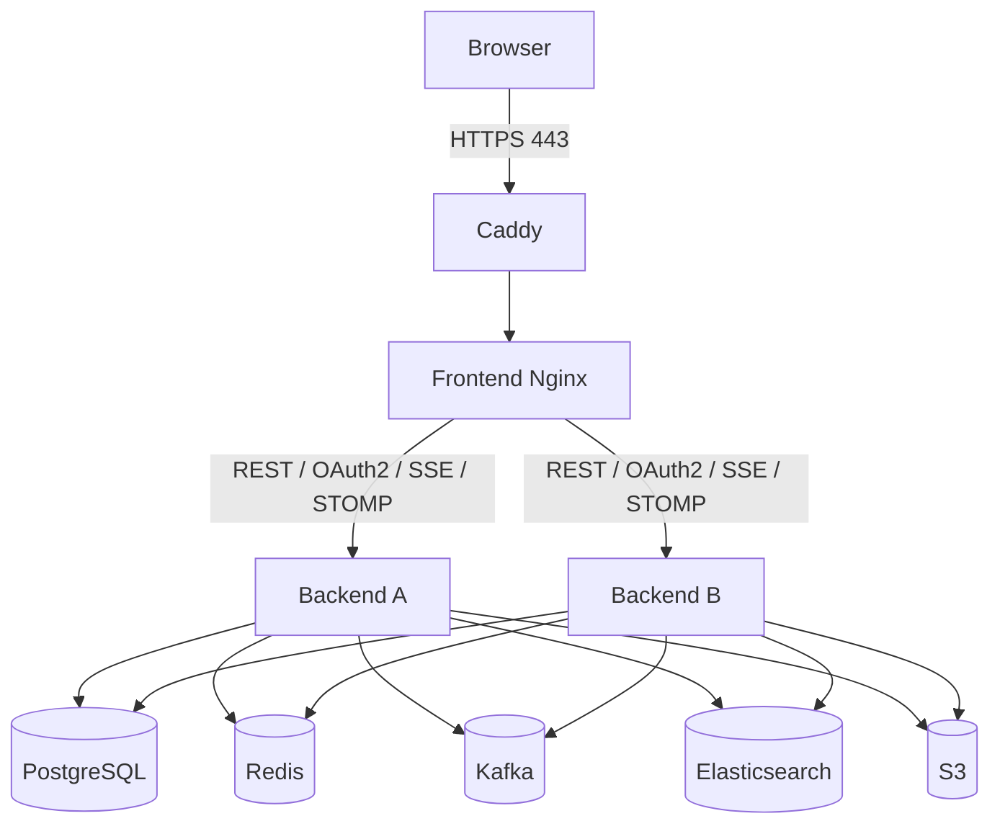
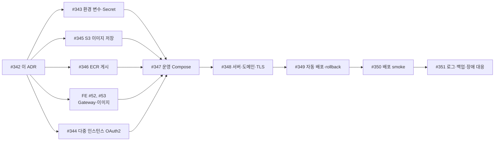

# ADR-009: MOPL 1차 배포 토폴로지와 운영 경계

- 상태: 확정
- 확정일: 2026-08-25
- 관련 이슈: [#342](https://github.com/ow00us/sb11-mopl-team1/issues/342)

## 맥락

현재 저장소에는 운영 이미지와 컨테이너 기동 smoke가 있지만, 이는 격리된 CI에서 이미지가 실행되는지를 확인하는 범위입니다. 외부 HTTPS 진입점, 프론트엔드와 백엔드의 라우팅, 데이터 영속성, Secret 주입, 실제 배포와 복구 경계는 아직 하나의 기준으로 고정되어 있지 않습니다.

1차 배포는 2026년 8월 31일까지 외부에서 접근 가능한 환경을 만드는 것을 목표로 합니다. 운영 복잡도를 제한하기 위해 한 대의 Linux 서버와 Docker Compose를 사용하되, 최종 상태는 백엔드 2개 인스턴스입니다. 2개로 올리는 시점의 선행 조건은 3절에 있습니다.

## 결정

### 1. 배포 단위와 외부 진입점

- 한 대의 Linux 서버에서 운영용 Docker Compose를 실행합니다.
- 서비스는 하나의 공개 도메인과 HTTPS origin을 사용합니다.
- Caddy가 호스트의 `80`, `443` 포트를 점유하고 TLS 종료, HTTP→HTTPS 전환, 인증서 발급·갱신을 담당합니다.
- 프론트엔드 Nginx는 Docker 내부에서 정적 파일 제공, SPA fallback, 백엔드 라우팅과 백엔드 A·B 분산을 담당합니다.
- 실제 도메인 이름과 서버 사업자는 #348에서 정합니다. 이 값은 토폴로지를 변경하지 않는 배포 입력입니다.

### 2. 동일 origin 라우팅 계약

| 공개 경로 | 처리 주체 | 내부 목적지 | 운영 조건 |
| --- | --- | --- | --- |
| `/`, `/assets/**` | Frontend Nginx | React 정적 파일 | 존재하지 않는 화면 경로는 `index.html`로 fallback합니다. |
| `/health` | Frontend Nginx | Frontend Nginx | 백엔드와 무관한 Gateway health입니다. |
| `/api/**` | Frontend Nginx | Backend A/B | SSE 경로도 포함하므로 proxy buffering을 끄고 긴 read timeout을 사용합니다. |
| `/oauth2/**` | Frontend Nginx | Backend A/B | OAuth2 인가 시작 요청입니다. |
| `/login/oauth2/code/**` | Frontend Nginx | Backend A/B | OAuth provider callback이 SPA fallback으로 빠지지 않게 별도 프록시합니다. |
| `/ws/**` | Frontend Nginx | Backend A/B | Upgrade·Connection 헤더와 긴 read/send timeout을 유지합니다. |

- Caddy와 Nginx는 원래 요청의 `Host`, client IP와 HTTPS scheme을 전달합니다.
- Nginx는 Caddy와의 내부 연결 scheme인 `http`로 `X-Forwarded-Proto`를 덮어쓰지 않습니다.
- OAuth callback URI는 forwarded header 해석에 기대지 않습니다. `prod` 프로파일이 `GOOGLE_OAUTH_REDIRECT_URI`처럼 외부 HTTPS 절대 URI를 직접 받고, refresh cookie의 `Secure`도 `REFRESH_TOKEN_COOKIE_SECURE`로 강제합니다. 프록시 뒤에서 백엔드가 자기 주소를 잘못 추론해도 이 두 경로는 영향을 받지 않습니다.
- 다만 백엔드에는 `server.forward-headers-strategy`가 설정되어 있지 않아 지금은 forwarded header를 해석하지 않습니다. 절대 URI로 지정하지 않은 경로에서 외부 host나 scheme이 필요해지면 그때 설정을 추가합니다. 판단과 적용은 #343이 맡습니다.
- `/actuator/**`는 공개 Gateway에 라우팅하지 않습니다. 배포·운영 검증은 서버 내부 또는 Compose 네트워크에서 각 백엔드 인스턴스를 직접 확인합니다.

### 3. 다중 인스턴스 경계

- Backend A와 B는 같은 PostgreSQL, Redis, Kafka, Elasticsearch와 S3를 사용합니다.
- 일반 HTTP 요청은 Nginx가 A와 B로 분산하며 sticky session을 사용하지 않습니다.
- SSE와 WebSocket은 최초 연결을 받은 인스턴스가 연결 종료까지 담당합니다.
- 다른 인스턴스에서 발생한 실시간 메시지는 Redis Pub/Sub relay로 전달합니다.
- refresh token, presence와 OAuth2 인가 요청처럼 인스턴스 사이에서 공유해야 하는 단기 상태는 Redis에 둡니다.
- 반대로 실시간 메시지 중복 제거는 인스턴스마다 따로 둡니다. 판정 질문이 "이 인스턴스가 자기 연결로 이미 보냈는가"이기 때문입니다. Redis로 공유하면 A가 자기 사용자에게 전달한 메시지를 B가 이미 처리된 것으로 보고 자기 사용자에게 보내지 않습니다.
- #344가 완료되어 OAuth2 인가 요청 상태를 공유하기 전에는 운영 백엔드를 1개 인스턴스로 제한합니다. 이후 A·B를 활성화합니다.

### 4. 네트워크와 공개 포트

운영 Compose는 역할별 내부 네트워크를 둡니다.

| 네트워크 | 참여 서비스 | 목적 |
| --- | --- | --- |
| `edge` | Caddy, Frontend Nginx | 외부 HTTPS 진입과 Gateway 전달 |
| `app` | Frontend Nginx, Backend A, Backend B | 애플리케이션 요청 분산 |
| `data` | Backend A, Backend B, PostgreSQL, Redis, Kafka, Elasticsearch | 데이터와 메시징 접근 |

- 호스트에 공개하는 서비스 포트는 Caddy의 `80`, `443`뿐입니다.
- SSH는 방화벽에서 허용된 관리 경로로 제한합니다.
- Frontend Nginx의 `8080`, Backend의 `8080`, PostgreSQL의 `5432`, Redis의 `6379`, Kafka와 Elasticsearch 포트는 호스트에 publish하지 않습니다.
- 관리 작업은 SSH로 서버에 접속한 뒤 Compose 네트워크 또는 `docker compose exec`를 통해 수행합니다.

### 5. 영속 데이터와 파일 저장소

서버 내 영속 데이터의 기준 경로는 `/srv/mopl`로 둡니다. #347에서 다음 경로를 명시적인 bind mount 또는 같은 이름의 관리 볼륨으로 연결합니다.

| 데이터 | 기준 위치 | 복구 원본 여부 |
| --- | --- | --- |
| PostgreSQL | `/srv/mopl/data/postgres` | 비즈니스 데이터의 원본입니다. 정기 백업과 복구 검증 대상입니다. |
| Redis | `/srv/mopl/data/redis` | 인증·presence 연속성을 위해 AOF를 사용하되 비즈니스 데이터의 백업 원본으로 간주하지 않습니다. |
| Kafka | `/srv/mopl/data/kafka` | 미처리 이벤트와 consumer offset을 보존합니다. 영속 볼륨 없이 운영하지 않습니다. |
| Elasticsearch | `/srv/mopl/data/elasticsearch` | 검색용 파생 데이터입니다. PostgreSQL에서 재색인할 수 있어야 합니다. |
| 백업 | `/srv/mopl/backups` | 서버 내 임시 보관 뒤 암호화하여 서버 밖 저장소로 복제합니다. |

- 프로필과 콘텐츠 이미지는 S3에 저장합니다. 애플리케이션과 프론트엔드 컨테이너 로컬 파일 시스템에는 사용자 업로드 파일을 저장하지 않습니다.
- S3 bucket은 versioning을 사용하며, 삭제·교체 정책과 실제 IAM 권한은 #345와 #351에서 확정합니다.
- 애플리케이션 로그는 표준 출력·표준 오류로만 기록합니다. **로그 전용 영속 볼륨을 두지 않습니다.** 컨테이너가 파일에 직접 쓰면 인스턴스마다 다른 파일이 생기고 회전 책임이 애플리케이션으로 넘어옵니다. Docker logging driver가 호스트에서 크기와 파일 수를 제한하며, 장기 보존이 필요한 감사 로그(`mopl.audit.*`)의 전달·보관은 #351에서 정합니다.

### 6. 환경 변수와 Secret 책임

- 애플리케이션이 요구하는 환경 변수의 이름, 필수 여부와 형식 검증은 저장소의 `application.yml`, 설정 클래스와 #343이 담당합니다.
- 실제 운영 값은 저장소 밖 `/etc/mopl/prod.env`에 두고 배포 전용 사용자만 읽을 수 있게 합니다.
- Compose 파일, GitHub 저장소, 컨테이너 이미지와 로그에는 Secret 값을 기록하지 않습니다.
- 서버에 환경파일을 생성·교체하고 최소 권한을 적용하는 책임은 #348에 있습니다.
- GitHub Actions는 배포 서버 접속 정보와 배포 승인 경계만 관리합니다. 애플리케이션 Secret 전체를 배포 로그나 workflow 입력으로 전달하지 않습니다.
- S3는 가능하면 서버 instance role 또는 기본 자격 증명 체인을 사용하고, 장기 access key를 코드에 고정하지 않습니다.

환경 변수 계약은 다음 범주를 모두 포함해야 합니다.

- PostgreSQL, Redis, Kafka, Elasticsearch
- JWT, CORS, WebSocket, refresh cookie
- Google·Kakao·Naver OAuth callback과 성공·실패 redirect
- SMTP, TMDB, SportsDB
- S3 bucket, region, 객체 prefix와 공개 URL
- Outbox, processed event, 실시간 relay 운영 조정값

### 7. Health와 배포 성공 판정

| 확인 대상 | 경로 또는 신호 | 용도 |
| --- | --- | --- |
| Frontend Gateway | `/health` | Caddy→Nginx와 정적 Gateway 확인 |
| Backend process | `/actuator/health/liveness` | 컨테이너 재시작과 기본 기동 판정 |
| Backend dependencies | `/actuator/health` | 배포 성공과 운영 경고 판정 |
| 실제 서비스 | #350 smoke | 공개 HTTPS, 인증, 핵심 API, S3, OAuth2, SSE·STOMP, Kafka·Outbox, Redis relay 확인 |

- Kafka listener나 Redis relay처럼 프로세스 재시작만으로 해결되지 않는 상태는 liveness에 포함하지 않습니다.
- 새 백엔드는 liveness와 전체 health가 모두 제한 시간 안에 통과한 뒤 요청 대상에 포함합니다.
- 배포 workflow는 A와 B를 한 번에 교체하지 않고 한 인스턴스씩 확인합니다.
- 실제 공개 경로 smoke가 실패하면 배포는 성공으로 기록하지 않습니다.

전체 health를 배포 게이트로 두려면 그것이 통과할 수 있는 상태여야 합니다. Spring Mail이 설정되어 있으면 Actuator가 SMTP 연결까지 집계에 넣습니다. CI container smoke가 mailpit을 함께 띄우는 이유가 이것입니다. Elasticsearch도 같은 방식으로 집계에 들어갑니다.

즉 운영 SMTP가 없으면 배포 직후부터 전체 health가 계속 `DOWN`이라 이 게이트를 넘을 수 없습니다. 둘 중 하나를 골라야 합니다.

- 운영 SMTP를 준비한다. 비밀번호 초기화가 실제로 동작해야 하므로 이쪽이 기본이다.
- 준비하지 못하면 메일 health component를 명시적으로 끄고, 비밀번호 초기화가 동작하지 않는다는 사실을 알려진 제약으로 남긴다.

어느 쪽을 택할지는 #348에서 정합니다. 정하지 않은 채 배포하면 게이트가 항상 실패합니다.

### 8. 최초 배포·재배포·복구 책임

| 작업 | 책임 이슈 | 경계 |
| --- | --- | --- |
| 서버 준비, 도메인, TLS, 방화벽, 운영 Secret 주입 | #348 | 빈 서버를 문서와 자동화 산출물로 재현합니다. |
| 백엔드 이미지 게시 | #346 | CI가 검증한 commit SHA 태그와 digest를 AWS ECR에 게시합니다. |
| 프론트엔드 Gateway·이미지 | FE #52, #53 | 동일 origin 라우팅과 검증된 프론트 이미지를 제공합니다. |
| 운영 런타임 조합 | #347 | 불변 image digest와 내부 네트워크·볼륨·healthcheck를 Compose로 고정합니다. |
| Flyway와 순차 배포·rollback | #349 | 새 이미지 pull, migration, A·B 순차 교체와 실패 시 이전 digest 복구를 담당합니다. |
| 배포 결과 검증 | #350 | 실제 HTTPS 환경의 사용자 흐름과 인스턴스 간 동작을 확인합니다. |
| 로그·백업·복구·장애 절차 | #351 | 백업을 실제 별도 환경에 복구하고 대응 절차를 기록합니다. |

- 배포 이미지는 `latest`가 아니라 commit SHA 태그 또는 digest로 지정하고 직전 성공 digest를 보존합니다. 되돌릴 대상이 레지스트리에 남아 있어야 rollback이 성립합니다.
- 백엔드와 프론트엔드는 같은 ECR 레지스트리를 씁니다. 서버가 내려받을 때는 EC2 instance role을 쓰고 장기 access key를 두지 않습니다. GitHub Actions가 push할 때는 OIDC로 역할을 맡습니다. 자격 증명 구성은 #346과 #348이 나눠 맡습니다.
- rollback은 애플리케이션 이미지와 Compose 설정을 직전 버전으로 되돌리는 범위입니다.
- 이미 적용한 파괴적 Flyway migration은 이미지 rollback만으로 복구되지 않습니다. 이전·신규 애플리케이션이 함께 동작할 수 있는 확장형 migration만 자동 배포 대상으로 허용하고, 역호환되지 않는 변경은 배포 전에 차단합니다.
- PostgreSQL은 최초 배포 전과 schema migration 전에 백업합니다. 백업 파일 생성만으로 완료하지 않고 #351에서 별도 환경 복구를 검증합니다.

### 9. 후속 작업 순서

- #343, #344, #345, #346과 FE #52, #53은 이 ADR 확정 뒤 병렬로 진행할 수 있습니다.
- #347은 운영 설정, S3와 양쪽 이미지 계약을 조합합니다.
- #348은 #347의 Compose를 실제 서버와 도메인에서 실행합니다.
- #349 이후에만 실제 배포 자동화와 rollback을 검증합니다.
- #350이 통과한 뒤 #351의 복구 훈련 결과까지 기록해야 1차 배포 작업을 종료합니다.

## 검토한 대안

### 프론트엔드 Nginx가 직접 TLS를 종료

프록시 계층이 하나 줄지만 인증서 발급·갱신과 정적 이미지 배포의 책임이 한 컨테이너에 섞입니다. 1차 배포에서는 인증서 자동화를 분리하기 위해 Caddy를 외부 진입점으로 둡니다.

### 외부에서 백엔드와 데이터 서비스를 각각 공개

별도 origin은 CORS, CSRF cookie, OAuth2 callback과 WebSocket 설정을 복잡하게 합니다. 데이터 서비스 공개는 공격면도 넓힙니다. 하나의 HTTPS origin과 내부 Docker 네트워크를 사용합니다.

### 백엔드 1인스턴스만 운영

구성은 단순하지만 이미 구현한 인스턴스 간 Redis relay와 다중 인스턴스 경계를 실제 배포에서 검증할 수 없습니다. 최종 상태는 2인스턴스로 하되, #344 완료 전의 OAuth2 안전을 위해 일시적인 1인스턴스 기동만 허용합니다.

### 애플리케이션 컨테이너에 이미지 저장

재배포와 인스턴스 전환 때 파일이 사라지거나 인스턴스마다 서로 다른 파일을 보게 됩니다. 사용자 업로드는 S3에 저장합니다.

## 결과

- 후속 이슈는 단일 서버·동일 HTTPS origin·Caddy·Frontend Nginx·Backend A/B·내부 데이터 네트워크를 공통 전제로 사용합니다.
- 현재 CI container smoke는 배포 가능한 이미지의 증거로 유지하지만 실제 운영 배포의 증거로 간주하지 않습니다.
- 실제 도메인, 서버 사업자, 비용, Secret 값과 보관 기간의 수치는 후속 이슈가 이 경계 안에서 정합니다.
